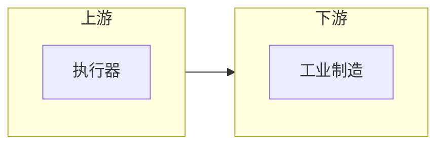

# 行业研究 → HTML 全流程

> 精简流程：搜索研报 → 财务分析 → 1份Markdown → 1份HTML → 部署上线
> 不生成PPT，直接输出可公开访问的网页。

## 流程总览

```
网上研报 (5-10篇)
    ↓ Step 1: anysearch 搜索
研报清单 + 参考文献
    ↓ Step 2: 财务分析
投资标的评级
    ↓ Step 3: 撰写
1份核心 Markdown
    ↓ Step 4: 渲染
1份单文件 HTML
    ↓ Step 5: 部署 (可选)
Cloudflare Pages 公开网页
```

## Step 1: 搜索研报

用 `websearch` 或 `anysearch` skill 搜索目标行业的公开研报。

> 如果本地已有行业资料（之前下载的报告、笔记、历史研报等），也允许通过 `Grep`/`Glob`/`Read` 从本地文件补充检索。不局限于纯 web 搜索。

**搜索策略**：
- 搜 5-10 篇高质量研报（券商年度策略、行业深度、公司深度）
- 关键词组合：`"<行业> 2026 策略"`, `"<行业> 深度研究"`, `"<行业> 投资机会"`
- 优先券商研报（中金、中信、中银、华泰等）和行业报告（亿欧、艾瑞等）

**输出文件**：`研报清单_按质量排序.md`

```markdown
# <行业>研报清单 - 按质量排序

## ⭐⭐⭐⭐⭐ 强烈推荐
### 1. <报告标题>
- **来源**：<券商/机构>
- **URL**：<链接>
- **核心观点**：<3-5条>

## ⭐⭐⭐⭐ 推荐
...

## 参考文献清单
| 序号 | 标题 | 来源 | URL |
|------|------|------|-----|
```

## Step 2: 企业财务分析

基于研报数据，分析目标企业的财务状况。

**分析维度**：
- 营收增速、净利润、毛利率
- 核心产品/技术壁垒
- 国产替代确定性
- 估值水平

**输出文件**：`企业财务分析.md`

```markdown
# <行业>企业财务分析

## 第一梯队：强烈推荐
| 企业 | 代码 | 营收 | 增速 | 净利润 | 核心亮点 | 评级 |
|------|------|------|------|--------|----------|------|

## 第二梯队：推荐
...

## 第三梯队：观望
...
```

## Step 3: 撰写核心 Markdown

将研报精华+财务分析整合为 1 份深度研报。

**文档结构**：
```markdown
# <行业>产业投资全景报告 | 2026

## 摘要
<300字核心结论>

## 一、行业发展全景
### 1.1 行业定义与分类
### 1.2 市场规模与增速
### 1.3 产业链图谱

## 二、核心驱动因素
### 2.1 政策驱动
### 2.2 技术驱动
### 2.3 需求驱动

## 三、细分赛道分析
### 3.1 <赛道A>
### 3.2 <赛道B>
...

## 四、重点标的分析
### 4.1 上市公司
### 4.2 未上市企业

## 五、投资建议
### 5.1 投资主线
### 5.2 风险提示

## 参考文献
```

**输出文件**：`<行业>产业投资全景报告.md`

### 图表策略：用 Mermaid 替代 ASCII 字符画

所有流程图、架构图、时间线、树形结构，必须使用 **Mermaid 语法**（` ```mermaid `），不要用无标注的 code fence 画 ASCII 框线图。

**原因**：`render-html` 对 ` ```mermaid ` 代码块渲染为 Mermaid.js SVG 矢量图（客户端渲染，可缩放、可复制），而对无标注的 ` ``` ` 只渲染为静态文本块。

**适用场景对照**：

| 原 ASCII 图类型 | Mermaid 替代 | 效果 |
|---|---|---|
| 层叠方框（三层技术栈等） | `flowchart TB` + subgraphs | 矢量框+箭头，子图分组 |
| 时间线（年份里程碑） | `timeline` | 原生时间线组件 |
| 三列流转（产业链上下游） | `flowchart LR` | 多列子图，自动布局 |
| 树形/梯队（IPO、组织层级） | `graph TD` | 树形展开 |
| 中心辐射（企业图谱） | `graph BT` / `graph TD` | 多方向汇聚 |

**写法示例**（参见本文 Step 4 渲染结果中的 Mermaid 图效果）：

```markdown

```

> 如果源文件已有 ASCII 字符画，建议先在 Step 3 中手动或借助 AI 转换为 Mermaid 语法（参考上表对照），再进行 Step 4 渲染。转换后可获得真正的 SVG 矢量流程图。

## Step 4: 渲染 HTML

使用 `render-html` skill 的 `industry-report` 模板，将 Markdown 报告渲染为单文件 HTML。

> 不要用硬编码的脚本（如 `render_report.py`）生成 HTML——应该用 `render-html` skill 的 `industry-report` 模板来完成渲染。该模板内置了暖棕+金色投行风格，无需额外设计参数。

```bash
# 找到 render_html.py 路径
RENDER_HTML="$CLAUDE_SKILL_DIR/scripts/render_html.py"
if [ ! -f "$RENDER_HTML" ]; then
  RENDER_HTML="~/.claude/skills/render-html/scripts/render_html.py"
fi

# 渲染 HTML
python3 "$RENDER_HTML" "行业报告.md" \
  --template industry-report \
  --out "行业报告.html" \
  --title "产业投资全景报告 | 2026" \
  --eyebrow "行业研报"
```

**模板特性**（`industry-report` 内置）：
- 色调：暖棕+金色（投行风格），深色 Hero 标题栏
- 布局：粘性侧边目录 + Hero大标题 + 卡片式内容区 + 响应式
- 特性：深色模式自动适配、移动端适配、打印友好
- 效果：专业投行研究报告风，适合正式阅读和分享

## Step 5: 部署到 Cloudflare Pages（可选）

```bash
bash scripts/deploy_cf.sh \
  <项目名> \
  "<HTML文件所在目录>"
```

**前置条件**：
- 已安装 `wrangler`：`npm install -g wrangler`
- 已登录 Cloudflare：`wrangler login`

**部署后**：公开网页 `https://<项目名>.pages.dev`

## 完整工作流示例

```bash
# 假设主题是"新能源汽车"
cd ~/Library/Mobile\ Documents/com~apple~CloudDocs/my\ all\ memory/度量衡/研报/

# 1. 搜索研报（用 anysearch 或 websearch）
# 输出：新能源汽车/研报清单_按质量排序.md

# 2. 财务分析
# 输出：新能源汽车/企业财务分析.md

# 3. 撰写核心报告
# 输出：新能源汽车/新能源汽车产业投资全景报告.md

# 4. 渲染 HTML（使用 render-html industry-report 模板，内置暖棕+金色投行风格）
#    输入：新能源汽车/新能源汽车产业投资全景报告.md
#    输出：新能源汽车/新能源汽车产业投资全景报告.html

# 5. 部署
bash scripts/deploy_cf.sh \
  xinnengyuan-auto \
  "新能源汽车/"
# → https://xinnengyuan-auto.pages.dev
```

## 相关文件

```
~/.claude/skills/industry-research/
├── SKILL.md                    # 本文件
└── scripts/
    └── deploy_cf.sh            # Cloudflare Pages 部署
```

**依赖的 skill**（由 Step 4 加载）：
- `/render-html` — Markdown → 单文件 HTML 渲染器，`industry-report` 模板提供暖棕+金色投行风格
  - 如果本地没有 `render-html` skill，运行 `/find-skills render-html` 搜索并安装
